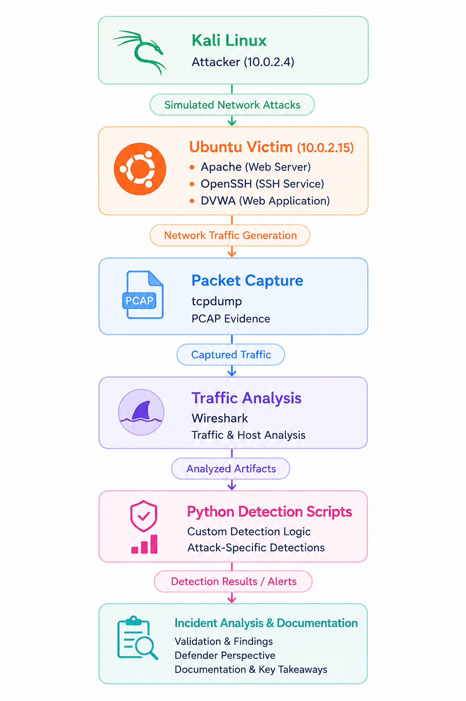
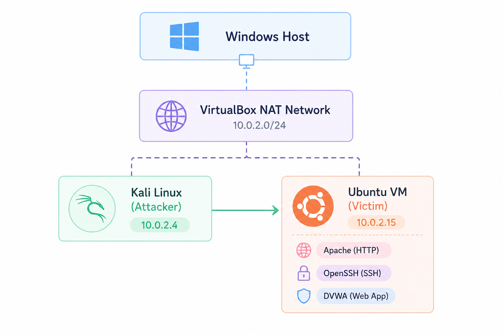

# Defensive Cyber Range for Network Attack Simulation and Detection


A portfolio-oriented cybersecurity project demonstrating how common network attacks can be simulated, observed, analyzed, and detected within an isolated virtual cyber range. The project combines packet capture, traffic analysis, and custom Python-based detection engineering to provide an end-to-end view of defensive security workflows.

---

## Overview

Modern defenders must understand not only how attacks are performed, but also how they appear in network traffic and host logs.

This project builds a fully isolated cyber range to simulate common network attacks, capture the resulting artifacts, analyze them using packet inspection tools, and implement lightweight Python-based detections that identify malicious activity using explainable logic.

The emphasis is on practical defensive cybersecurity, reproducible experimentation, and understanding how detection decisions are made—not on offensive exploitation or enterprise-scale tooling.

---

## Features

- Isolated VirtualBox-based cyber range
- Six simulated network attack scenarios
- Packet capture using **tcpdump**
- Traffic analysis with **Wireshark**
- Custom Python detection scripts built from scratch
- Host and network artifact analysis
- Structured incident documentation
- Reproducible defensive security workflows

---

## Simulated Attack Scenarios

| Attack | Detection |
|---------|-----------|
| ICMP Host Discovery | ICMP Echo Request Detection |
| TCP SYN Scan | SYN Scan Detection |
| HTTP Service Enumeration | HTTP Service Enumeration Detection |
| SSH Authentication Failures | Repeated SSH Authentication Failure Detection |
| Web Directory Enumeration | Directory Enumeration Detection |
| Web Authentication | Repeated HTTP Authentication Detection |

---

## Technology Stack

| Category | Technologies |
|----------|--------------|
| Virtualization | Oracle VirtualBox |
| Operating Systems | Kali Linux, Ubuntu Linux |
| Network Capture | tcpdump |
| Packet Analysis | Wireshark |
| Detection Development | Python 3.12, PyShark, TShark |
| Target Services | Apache HTTP Server, OpenSSH, DVWA |

---

## Project Workflow

The project follows a repeatable defensive security workflow.

```text
Attack Simulation
        │
        ▼
Packet Capture
        │
        ▼
Traffic Analysis
        │
        ▼
Detection Engineering
        │
        ▼
Alert Generation
        │
        ▼
Incident Analysis
```

A visual representation of the workflow is available below.



---

## Cyber Range Architecture

The laboratory consists of an isolated attacker and victim connected through a VirtualBox NAT Network.



### Environment

| Component | Configuration |
|-----------|---------------|
| Attacker | Kali Linux (10.0.2.4) |
| Victim | Ubuntu Linux (10.0.2.15) |
| Network | VirtualBox NAT Network |
| Services | Apache, OpenSSH, DVWA |

> **Security Note**
>
> - Fully isolated virtual environment
> - No interaction with public systems
> - No access to the hostel LAN
> - All experimentation performed locally

---

## Repository Structure

```text
.
├── captures/      Packet captures for each simulated attack
├── detections/    Python-based detection scripts
├── diagrams/      Architecture and workflow diagrams
├── docs/          Lab, attack, and detection documentation
├── logs/          Host-based log files used for detection
└── README.md
```

---

## Documentation

Each attack includes comprehensive technical documentation covering:

- Attack overview
- Objectives
- Commands executed
- Packet analysis
- Network artifacts
- Host artifacts (where applicable)
- Detection methodology
- Validation results
- Defender perspective
- Limitations
- Key takeaways

The repository also includes:

- Lab setup documentation
- Packet capture methodology
- Detection engineering documentation
- Supporting screenshots and diagrams

---

## Running the Detection Scripts

Install the required dependency:

```bash
pip install pyshark
```

Ensure **TShark** is installed and available on your system.

Run a detector:

```bash
python detections/detect-syn-scan.py captures/attack-02/syn-scan.pcap
```

Refer to the documentation for attack-specific examples and expected outputs.

---

## Learning Outcomes

This project demonstrates practical experience with:

- Cyber range construction
- Network traffic analysis
- Packet capture methodologies
- Common attack techniques
- Detection engineering
- Incident analysis
- Python scripting for cybersecurity
- Technical documentation

---

## Future Enhancements

Potential future improvements include:

- Zeek-based network analysis
- Suricata rule development
- Additional attack scenarios
- Automated reporting
- SIEM integration
- Expanded detection coverage

---

## Ethical Scope

All experiments were conducted within an isolated VirtualBox NAT network using virtual machines owned and controlled by the author.

No public systems, external networks, or unauthorized devices were targeted.

This project is intended solely for cybersecurity education, defensive research, and professional skill development.

---

## License

This project is released under the MIT License.