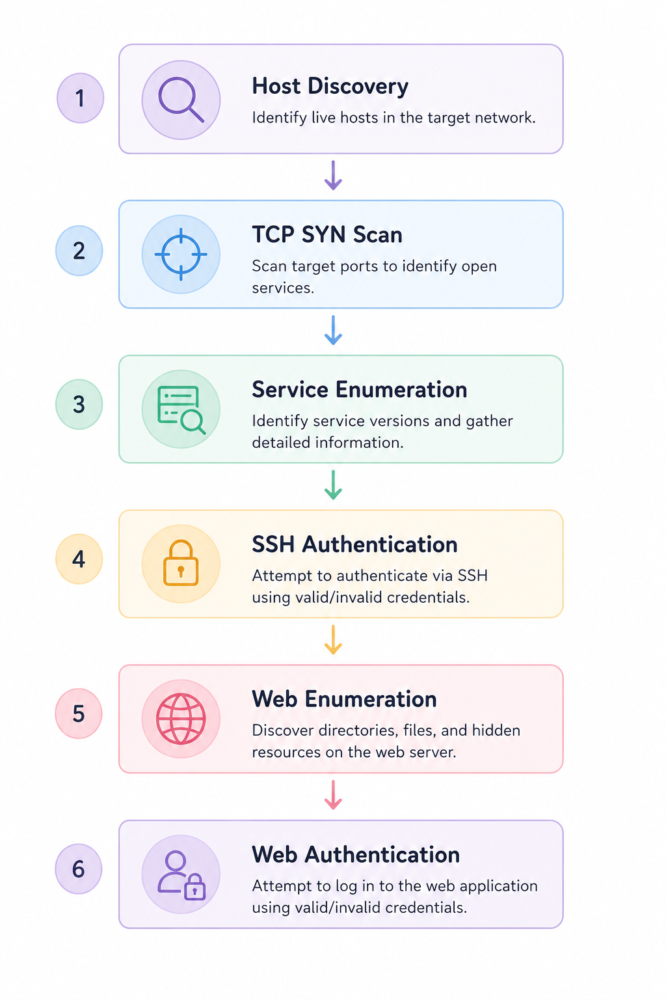

# Documentation

## Overview

This directory contains the technical documentation for the attack simulations and corresponding detection techniques implemented in this project.

Each attack was executed within an isolated cyber range, captured as network traffic, analyzed using Wireshark, and documented from a defender's perspective. Every attack is paired with a corresponding detection document describing the implemented Python-based detection logic and validation results.

---

## Documentation Structure

Each attack directory contains:

- **Attack Documentation** – Describes the attack objective, methodology, observed artifacts, packet analysis, screenshots, and defender observations.
- **Detection Documentation** – Explains the detection objective, implementation, detection logic, validation results, limitations, and key takeaways.

---

## Attack Scenarios

| Attack | Description |
|---------|-------------|
| Attack 01 | Host Discovery (ICMP) |
| Attack 02 | TCP SYN Scan |
| Attack 03 | HTTP Service Enumeration |
| Attack 04 | SSH Authentication Failures |
| Attack 05 | Web Enumeration |
| Attack 06 | Web Authentication |

---

## Documentation Workflow

The attack experiments were carried out as follows.

Each scenario follows the same repeatable process:

1. Simulate the attack.
2. Capture network traffic.
3. Analyze attack artifacts.
4. Develop a Python-based detection script.
5. Validate the detection.
6. Document observations and findings.

---

## Documentation Standards

Each attack document includes:

- Overview
- Attack Summary
- Commands Executed
- Packet Analysis
- Network and Host Artifacts
- Screenshots
- Defender Perspective
- Key Takeaways

Each detection document includes:

- Overview
- Detection Objective
- Detection Logic
- Detection Strategy
- Implementation
- Validation Results
- Sample Output
- Detection Accuracy
- Potential False Positives
- Limitations
- Defender Perspective
- Key Takeaways

---

## Purpose

The documentation is intended to provide a structured, reproducible record of the attack simulations and demonstrate how common network attacks can be observed, analyzed, and detected using lightweight, explainable Python-based detection techniques.