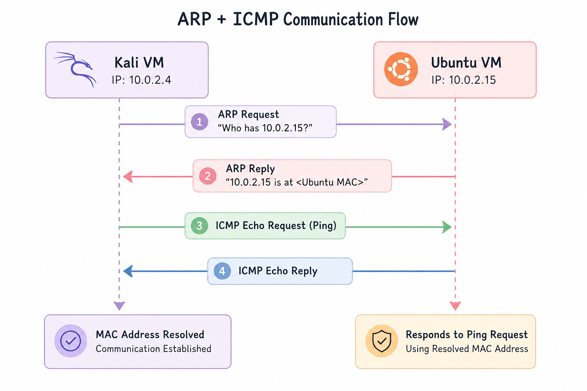

# Attack 01 - Host Discovery

## Objective

Determine whether a target host is reachable on the network using ICMP Echo Requests while observing the resulting network artifacts from a defender's perspective.

---

## Environment

| System | Role | IP Address |
|---------|------|------------|
| Kali Linux | Attacker | 10.0.2.4 |
| Ubuntu | Victim | 10.0.2.15 |

Network: VirtualBox NAT Network

---

## Attack Overview

Host discovery is commonly the first step after gaining access to a network. An attacker attempts to identify which hosts are online before performing further reconnaissance.

For this experiment, a simple ICMP ping was used to verify host reachability.

---

## Procedure

1. Started packet capture on Kali.
2. Sent four ICMP Echo Requests to the Ubuntu VM.
3. Received four ICMP Echo Replies.
4. Stopped packet capture.
5. Analyzed the resulting traffic using Wireshark.

---

## Evidence Collected

- baseline_capture.pcap
- attack01_ping.pcap

---

## Observed Network Artifacts

Protocols observed:

- ARP
- ICMP
- DHCP (background traffic)

Communication sequence:

ARP Request
→ ARP Reply
→ ICMP Echo Request
→ ICMP Echo Reply

A total of four Echo Requests and four Echo Replies were observed.

---

## ARP + ICMP Communication Flow

The following diagram illustrates the communication sequence between the Kali and Ubuntu virtual machines. Kali first resolves Ubuntu's MAC address using an ARP Request/Reply exchange, then sends an ICMP Echo Request (ping). Ubuntu responds with an ICMP Echo Reply, confirming successful network connectivity after address resolution.

---

## Defender Observations

A defender monitoring the network would observe:

- Host 10.0.2.4 initiating communication
- Successful reachability verification
- ARP resolution before ICMP communication
- Symmetric request/reply traffic indicating normal connectivity testing

---

## Detection Opportunities

Possible detection indicators include:

- High volume ICMP activity
- Sequential host discovery across multiple IP addresses
- Repeated ICMP requests from a single source

A single ping is generally considered benign, while repeated discovery activity may warrant investigation.

---

## Limitations

A simple ICMP ping generates minimal telemetry and is unlikely to trigger alerts in isolation.

Modern attackers may avoid ICMP entirely if they suspect it is monitored or blocked.

---

## Key Takeaways

- Host discovery is often the first observable stage of reconnaissance.
- ARP resolution precedes communication within a local network.
- Even simple reconnaissance generates identifiable network artifacts.
- Packet captures provide valuable evidence for understanding attacker behavior from a defender's perspective.