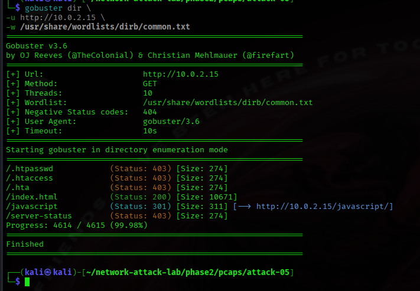
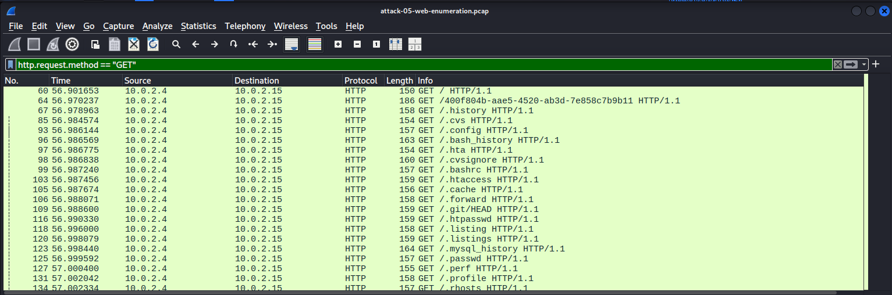
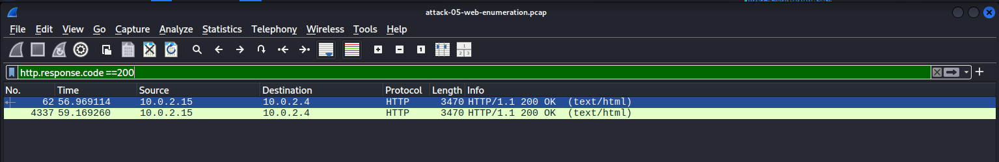
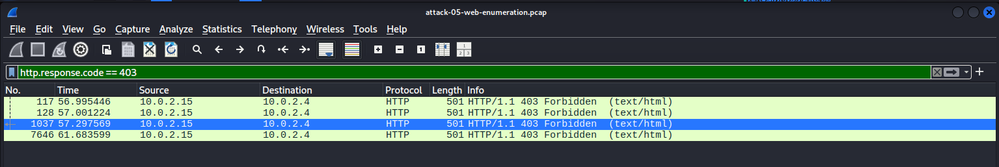

# Attack 05 — Web Application Enumeration

## Objective

Perform automated directory enumeration against a web server to identify accessible resources, hidden directories, and restricted endpoints through HTTP requests.

---

## Environment

| Component | Details |
|----------|---------|
| Attacker | Kali Linux (10.0.2.4) |
| Victim | Ubuntu Server (10.0.2.15) |
| Service | Apache HTTP Server |
| Tool | Gobuster v3.6 |
| Capture Tool | tcpdump |
| Analysis Tool | Wireshark |

---

## Attack Overview

After identifying an active web service during service enumeration, attackers commonly attempt to discover additional directories and files that may not be directly linked from the website. Automated directory enumeration tools generate a large number of HTTP requests using predefined wordlists to identify accessible resources, administrative interfaces, backups, or misconfigured endpoints.

In this lab, Gobuster was used to enumerate the Apache web server using a standard directory wordlist while network traffic was captured for analysis.

---

## Attack Method

### Packet Capture

```bash
sudo tcpdump -i eth0 -w attack-05-web-enumeration.pcap
```

### Directory Enumeration

```bash
gobuster dir \
-u http://10.0.2.15 \
-w /usr/share/wordlists/dirb/common.txt
```

---

## Gobuster Enumeration Results

Gobuster directory enumeration against the Apache web server. The scan identifies accessible (200 OK), redirected (301 Moved Permanently), and restricted (403 Forbidden) resources by issuing automated HTTP GET requests.





## Automated HTTP Requests

Wireshark capture showing the rapid sequence of HTTP GET requests generated by Gobuster during directory enumeration. The repetitive request pattern is characteristic of automated reconnaissance activity.



## Successful Resource Discovery

HTTP response showing 200 OK for /index.html, confirming that the requested resource exists and is publicly accessible.




## Restricted Resource

HTTP response showing 403 Forbidden for a protected resource (.htaccess), indicating that the resource exists but access is denied by the web server configuration.



## Directory Redirection

HTTP response showing 301 Moved Permanently for /javascript, redirecting the client to the canonical directory path ending with a trailing slash.


---

## Results

Gobuster successfully identified several resources exposed by the web server.

| Resource | Status |
|----------|--------|
| /index.html | 200 OK |
| /javascript | 301 Moved Permanently |
| /.htaccess | 403 Forbidden |
| /.htpasswd | 403 Forbidden |
| /.hta | 403 Forbidden |
| /server-status | 403 Forbidden |

Approximately **9,885 packets** were captured during the enumeration process.

---

## Packet Analysis

The packet capture shows a sustained sequence of HTTP GET requests issued in rapid succession. Each request corresponds to an entry in the supplied wordlist, with the server responding using standard HTTP status codes.

Observed response types include:

- **200 OK** for accessible resources.
- **301 Moved Permanently** for redirected directories.
- **403 Forbidden** for protected resources.
- Numerous **404 Not Found** responses for non-existent paths.

Unlike manual browsing, the automated nature of the requests creates a distinctive reconnaissance pattern characterized by repetitive HTTP requests within a short time interval.

---

## Observed Artifacts

### Network

- TCP connections to port 80
- HTTP GET requests
- HTTP response status codes
- Repetitive request pattern
- High request frequency
- Enumeration of common web paths

### Host

No authentication events or system log artifacts were intentionally analyzed during this attack. The focus was on observable network behavior.

---

## Defender Perspective

Directory enumeration is a common reconnaissance technique used before exploitation. While individual HTTP requests appear legitimate, the overall request pattern is highly unusual compared to normal user browsing.

Indicators include:

- Hundreds or thousands of sequential requests
- Requests targeting predictable administrative or hidden paths
- High concentration of HTTP 404 responses
- Multiple requests from a single client over a short period

Monitoring these behavioral characteristics can help defenders identify reconnaissance attempts before exploitation begins.

---

## Detection Opportunities

Potential detection approaches include:

- Monitoring abnormal HTTP request rates
- Detecting excessive HTTP 404 responses
- Identifying requests matching known enumeration wordlists
- Alerting on repeated access to administrative or hidden resources
- Correlating multiple HTTP requests from a single source within a short time window

---

## Limitations

- Enumeration was performed against a local Apache server in a controlled environment.
- HTTPS encryption was not used.
- Only a standard Gobuster wordlist was evaluated.
- No exploitation or modification of server resources was performed.

---

## Key Takeaways

- Directory enumeration significantly increases HTTP traffic compared to normal browsing.
- HTTP status codes reveal valuable information about server resources.
- Automated reconnaissance exhibits recognizable network patterns.
- Enumeration often follows successful host discovery and service identification.
- Early detection of reconnaissance can help prevent subsequent attacks.