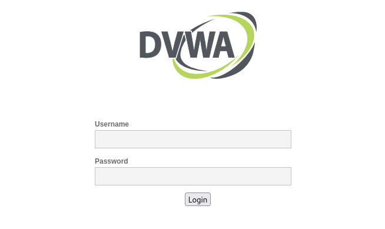

# Attack 06 — Web Authentication Analysis

## Objective

Analyze web-based authentication by observing HTTP login requests transmitted between a client and a web application. The objective is to compare application-layer authentication over HTTP with the encrypted SSH authentication examined in the previous attack.

---

## Environment

| Component | Details |
|----------|---------|
| Attacker | Kali Linux (10.0.2.4) |
| Victim | Ubuntu Server (10.0.2.15) |
| Web Application | Damn Vulnerable Web Application (DVWA) |
| Web Server | Apache HTTP Server |
| Interception Tool | Burp Suite Community Edition |
| Packet Capture | tcpdump |
| Analysis Tool | Wireshark |

---

## Attack Overview

Web applications commonly authenticate users through HTTP requests containing submitted login credentials. Security analysts frequently intercept these requests during penetration testing to understand application behavior, validate security controls, and identify insecure transmission of sensitive information.

In this experiment, Burp Suite was used to intercept authentication requests while network traffic was captured for packet-level analysis.

---

## Attack Method

### Packet Capture

```bash
sudo tcpdump -i eth0 -w attack-06-web-authentication.pcap
```

### Authentication Request

1. Configure Firefox to proxy traffic through Burp Suite.
2. Access the DVWA login page.
3. Submit invalid credentials.
4. Intercept the HTTP POST request.
5. Forward the request to the web server.
6. Observe the failed authentication response.
7. Stop packet capture after completing the analysis.

---

## Packet Analysis

The captured traffic shows an HTTP POST request sent from the client to the DVWA login page containing the submitted authentication parameters. Because the application uses HTTP rather than HTTPS, the request contents are transmitted in plaintext and can be reconstructed from the packet capture.

Analysis of the HTTP stream reveals:

- HTTP POST request to the authentication endpoint
- Form-encoded login parameters
- Server response indicating authentication failure
- Complete request and response exchange within the TCP session

Unlike the SSH authentication observed in Attack 4, the submitted credentials are directly visible within the captured HTTP traffic.

---

## Observed Artifacts

### Network

- TCP connection to port 80
- HTTP POST authentication request
- HTTP response from the server
- Form-encoded request body
- Authentication exchange visible in plaintext

### Application

- Invalid login message displayed by DVWA
- Authentication request processed by the web application

---

## Analysis
The following figures illustrate the web authentication process against the DVWA application. The captured evidence includes the login interface, intercepted HTTP POST requests, packet-level communication, reconstructed HTTP streams, and the server's response to failed authentication attempts.

Figure 1 — DVWA Login Interface


DVWA login interface hosted on the Ubuntu web server, used to generate HTTP authentication requests for analysis.

Figure 2 — Burp Suite Intercepting the HTTP POST Request


Burp Suite intercepting the HTTP POST request submitted during a login attempt. The request body contains the authentication parameters before being forwarded to the web server.

Figure 3 — Wireshark Packet Capture


Wireshark capture showing the HTTP POST authentication request and subsequent HTTP responses exchanged between the Kali attacker and Ubuntu web server.

Figure 4 — Follow HTTP Stream


HTTP stream reconstruction displaying the complete authentication exchange, including the submitted form parameters transmitted over unencrypted HTTP.


## Defender Perspective

Unencrypted web authentication exposes sensitive information to anyone capable of observing network traffic. While this behavior is intentionally demonstrated using DVWA in a controlled laboratory environment, production systems should protect authentication traffic using HTTPS.

Security monitoring can identify repeated authentication attempts, unusual login behavior, or abnormal request patterns that may indicate credential attacks.

---

## Detection Opportunities

Potential detection approaches include:

- Monitoring repeated HTTP POST requests to login endpoints
- Detecting multiple failed authentication attempts
- Correlating repeated login failures from a single client
- Monitoring unusually high authentication request rates
- Alerting on authentication activity transmitted over unencrypted HTTP where encryption is expected

---

## Limitations

- DVWA is intentionally vulnerable and designed for security training.
- Authentication was performed over HTTP to demonstrate observable network traffic.
- Only failed authentication attempts were analyzed.
- No exploitation beyond authentication analysis was performed.

---

## Comparison with SSH Authentication

| SSH Authentication (Attack 04) | Web Authentication (Attack 06) |
|--------------------------------|--------------------------------|
| SSH protocol | HTTP protocol |
| Encrypted authentication | Plaintext HTTP authentication |
| Credentials protected during transmission | Credentials visible in packet capture |
| Authentication recorded in system logs | Authentication handled by the web application |

---

## Key Takeaways

- HTTP authentication exchanges can be reconstructed from packet captures when encryption is absent.
- Burp Suite provides detailed visibility into intercepted web requests during security testing.
- Wireshark enables packet-level analysis of authentication traffic.
- Authentication mechanisms differ significantly between encrypted protocols such as SSH and unencrypted web applications.
- Secure web applications should protect authentication traffic using HTTPS to prevent credential exposure.