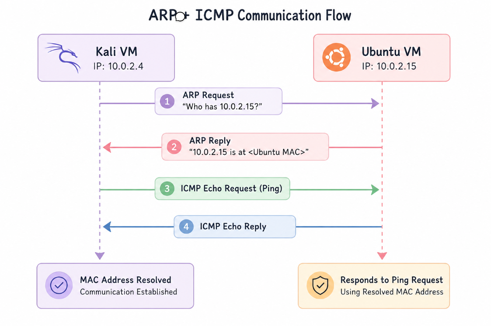

## ARP + ICMP Communication Flow

The following diagram illustrates the communication sequence between the Kali and Ubuntu virtual machines. Kali first resolves Ubuntu's MAC address using an ARP Request/Reply exchange, then sends an ICMP Echo Request (ping). Ubuntu responds with an ICMP Echo Reply, confirming successful network connectivity after address resolution.

