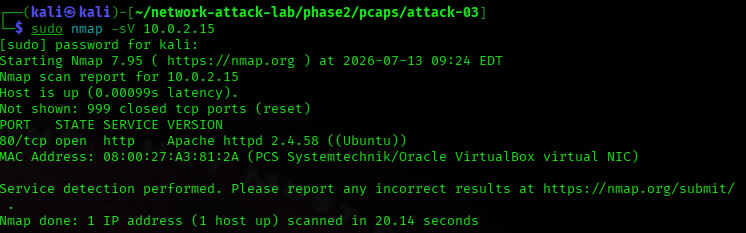

## Packet Analysis

The packet capture shows application-layer communication generated during service enumeration. Unlike a TCP SYN scan, Nmap exchanged HTTP requests and responses with the target to identify the web server and its version. This resulted in substantially more network traffic and richer forensic evidence.

