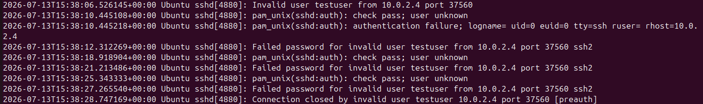

## Authentication Log Analysis

The following authentication log shows multiple failed SSH login attempts from the Kali VM (`10.0.2.4`) targeting the Ubuntu VM. The SSH service rejects the login because the username `testuser` does not exist, generating `Invalid user`, `authentication failure`, and `Failed password` events before terminating the connection with `Connection closed`.

