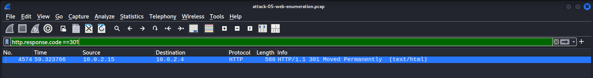

## Gobuster Enumeration Results

Gobuster directory enumeration against the Apache web server. The scan identifies accessible (200 OK), redirected (301 Moved Permanently), and restricted (403 Forbidden) resources by issuing automated HTTP GET requests.

## Automated HTTP Requests

Wireshark capture showing the rapid sequence of HTTP GET requests generated by Gobuster during directory enumeration. The repetitive request pattern is characteristic of automated reconnaissance activity.

## Successful Resource Discovery

HTTP response showing 200 OK for /index.html, confirming that the requested resource exists and is publicly accessible.

## Restricted Resource

HTTP response showing 403 Forbidden for a protected resource (.htaccess), indicating that the resource exists but access is denied by the web server configuration.

## Directory Redirection

HTTP response showing 301 Moved Permanently for /javascript, redirecting the client to the canonical directory path ending with a trailing slash.

