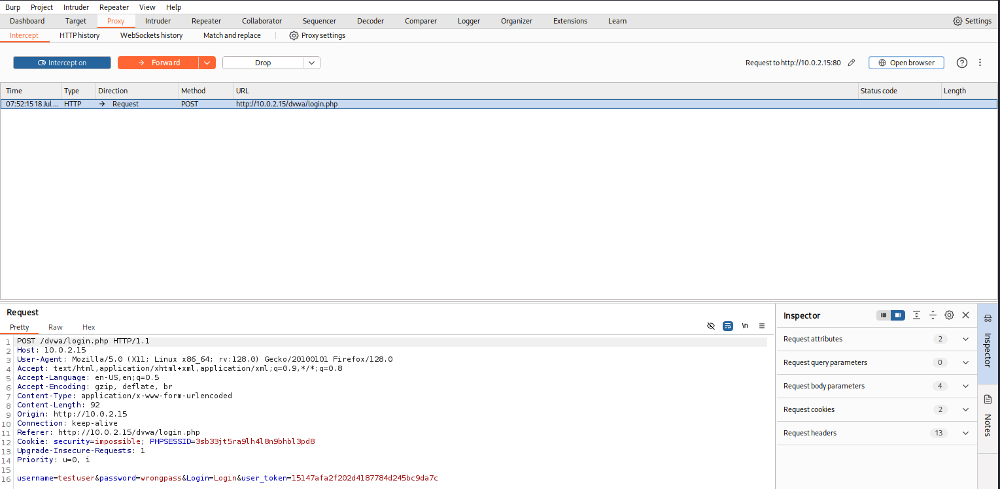
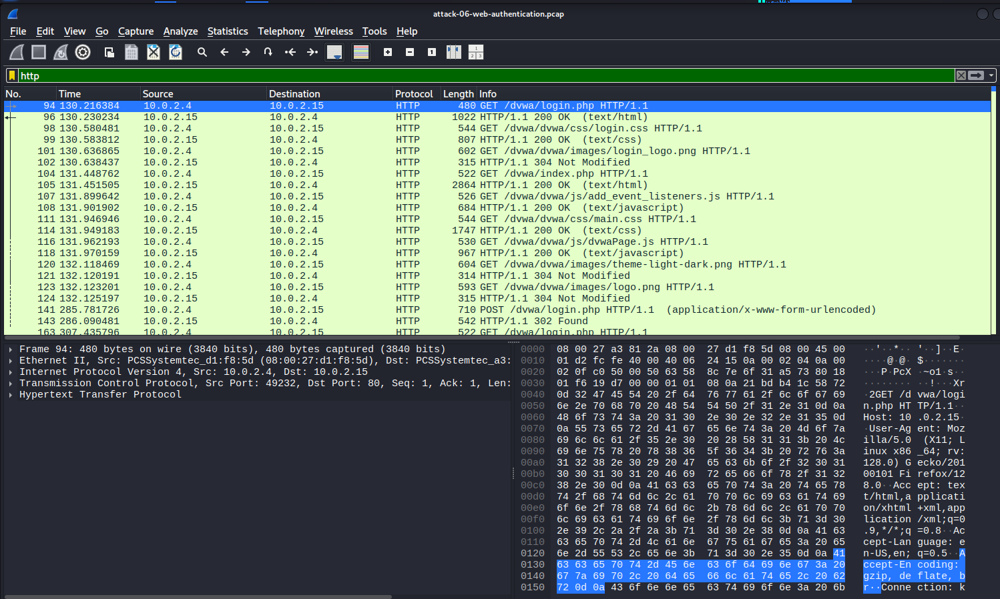
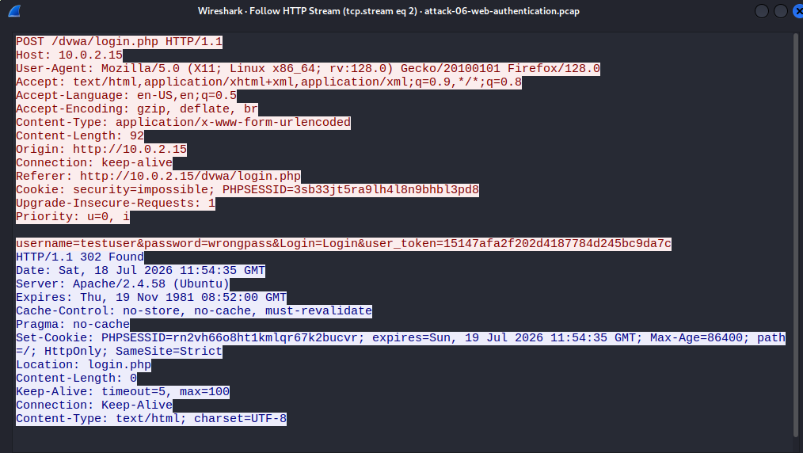

## Web Authentication Analysis
The following figures illustrate the web authentication process against the DVWA application. The captured evidence includes the login interface, intercepted HTTP POST requests, packet-level communication, reconstructed HTTP streams, and the server's response to failed authentication attempts.

Figure 1 — DVWA Login Interface

DVWA login interface hosted on the Ubuntu web server, used to generate HTTP authentication requests for analysis.

Figure 2 — Burp Suite Intercepting the HTTP POST Request

Burp Suite intercepting the HTTP POST request submitted during a login attempt. The request body contains the authentication parameters before being forwarded to the web server.

Figure 3 — Wireshark Packet Capture

Wireshark capture showing the HTTP POST authentication request and subsequent HTTP responses exchanged between the Kali attacker and Ubuntu web server.

Figure 4 — Follow HTTP Stream

HTTP stream reconstruction displaying the complete authentication exchange, including the submitted form parameters transmitted over unencrypted HTTP.
